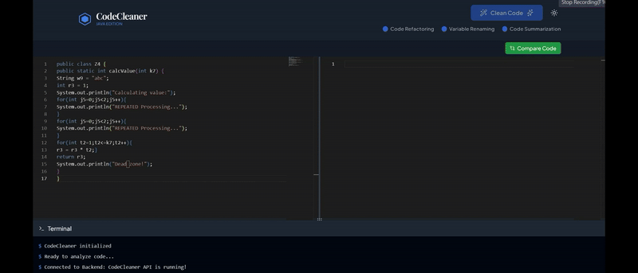

# CodeCleaner
CodeCleaner is an innovative tool designed to streamline code quality improvement by automating comprehensive documentation, enhancing readability through intelligent variable renaming, and enforcing consistent coding practices across large-scale projects



## Requirments
- Python 3 (>= v3.12)
- Fastapi (>= v0.115)
- Nltk (>= v3.9)
- Tqdm (>= v4.66)
- pydantic (>= v2.11)
- ollama (optional; >= v0.4)
- openai (>= v1.70)
- sacrebleu (optional; >=v2.5)

## Install Dependencies

### Installing backend

Change to the backend directory and type the following command:

```
pip install -r requirements.txt
```

### Installing frontend

Change to the frontend directory and type the following command:

```
npm install
```

### Installing Other Dependencies

- **`summaryT5`**  
  To train the model, run:
  ```bash
  python model.py
  ```

- `Ollama` (Optinal for Deepseek)
     Download Using link : https://ollama.com/download
     <br/>
     Then run the command:
     ``` 
     ollama pull deepseek-coder:6.7b
    ``` 
    (Ensure you have sufficient disk space, as the model requires approximately 3.8GB of storage.)

## Running the Application

1. Start the Backend
Change to the backend directory and type the following command:
```bash
uvicorn main:app --host 0.0.0.0 --port 8000 --reload
```
(Wait for it to show "Application startup complete.")

2. Start the FrontEnd React Application:
Change to the frontend directory and type the following command:
```bash
npm run dev
```
Open your web browser and navigate to:
```
http://localhost:5000
```

## Usage

1. Enter or paste Any Java code that you want to Clean in the left text area
2. Choose Which all Cleaning operation you want (Code Optimization,Variable Renaming,Code Summarization)
3. Click the "CleanCode" button
4. Wait for the analysis to complete
5. View the Cleaned Code in the right text area
